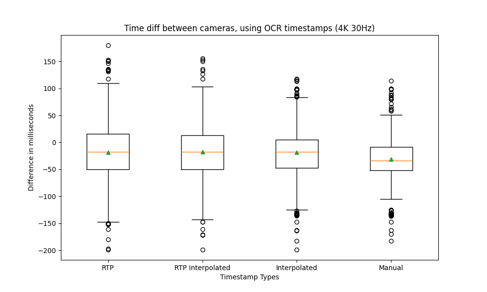
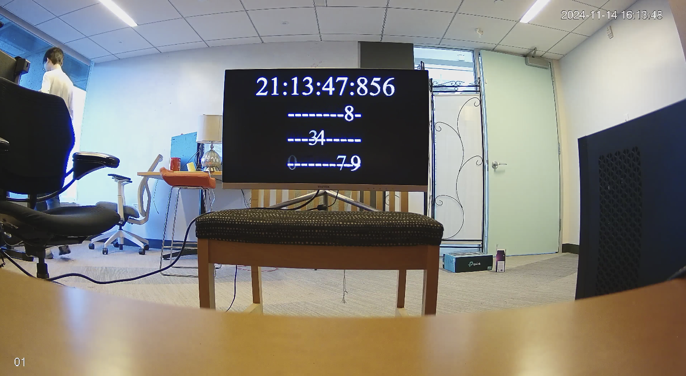
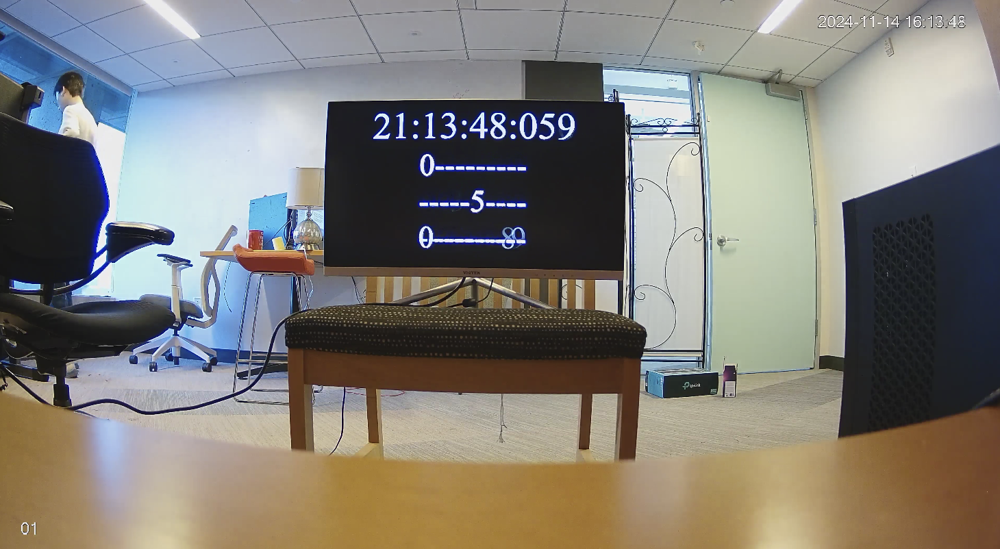

# RTCP-NTP-Recorder

## Overview

**RTCP-NTP-Recorder** is a tool for recording RTSP streams while embedding precise timestamps into H.264 video frames using RTCP-provided NTP information. This tool can be used for:

- Recording video and audio from RTSP streams
- Embedding NTP timestamps from [RTCP Sender Reports](https://www4.cs.fau.de/Projects/JRTP/pmt/node83.html) into [H.264 User Data Unregistered SEI Message](https://learn.microsoft.com/en-us/openspecs/office_protocols/ms-h264pf/3d5fb9c1-efe8-4092-a60d-5321adce9c2e)
- Synchronizing cameras if they have accurate internal clocks. (e.g., those are synchronized with NTP servers.)

## Components

**RTCP-NTP-Recorder** consists of two main components:

1. **Recorder**:
   - A C-based client that connects to an RTSP server to record video and audio streams.
   - Embeds NTP timestamps into H.264 video frame metadata.
2. **Extractor**:
   - A Python script to extract timestamps from recorded video files.

## Installation

### Prerequisites

- **GStreamer Library**: required for RTSP stream handling. Tested with GStreamer version 1.24.9
  - **macOS**: Use [Homebrew](https://brew.sh/) with the command:
  ```sh
  brew install gstreamer
  ```
  - **Ubuntu**: Use `apt` with the command:
  ```sh
  sudo apt install gstreamer1.0-plugins-bad gstreamer1.0-plugins-good gstreamer1.0-tools libgstreamer-plugins-bad1.0-dev libgstreamer-plugins-base1.0-dev libgstreamer1.0-dev
  ```
- **Python**: tested with this 3.12, but should work with other versions
- **PyAV**: Python bindings for FFmpeg. Installation instructions are available on the [PyAV GitHub page](https://github.com/PyAV-Org/PyAV).
- **xmake**: build tool been used

  - **macOS**:

  ```sh
  brew install xmake
  ```

  - **Ubuntu**:

  ```sh
  sudo apt install 7zip build-essential git xmake
  ```

### Build

Run the following command to build the **Recorder**:

```sh
xmake
```

Run the following command to generate `compile_commands.json` for supported tools (e.g., VSCode, CLion, Clangd):

```sh
xmake project -k compile_commands
```

## Usage

### Recorder

To start recording an RTSP stream, use the following command:

```sh
./recorder <RTSP_URL> <output_filename_without_extension>
```

- Replace `<RTSP_URL>` with the URL of the stream.
- Replace `<output_filename_without_extension>` with the desired output filename without the extension. e.g., `LivingRoomCamera`.

### Extractor

To extract timestamps from the recorded video file, use the following command:

```sh
python3 extractor.py <video_filename>
```

- Replace `<video_filename>` with the recorded video file.

When the script finishes, it will generate 4 files:

- `<video_filename>_meta.txt`: Contains the extracted metadata for each frame, it is used to avoid re-extracting the metadata.
- `<video_filename>.txt`: Contains the extracted timestamps, which is calculated by adding RTP relative time to NTP time in the most recent RTCP SR. Detailed math is described in [ntp_calc.py](./tools/ntp_calc.py)
- `<video_filename>_RTP_interpolated.txt`: Contains the timestamps interpolated using two RTCP SR packets, this is used to avoid time rewinding in the previous method.
- `<video_filename>_interpolated.txt`: Contains the timestamps interpolated using only RTCP SR packets and do not refer to the RTP timestamps. This method assumes each frame are equally spaced in time (Not always true for some cameras).

## Performance

The level of syncing have been tested with Amcrest IP cameras using different video resolutions and frame rates. Two cameras were synchronized with the same local NTP server and recorded simultaneously.

The results are as follows:

| Metric                      | RTP Timestamp | RTP Interpolated Timestamp | Interpolated Timestamp | Manual  |
| --------------------------- | ------------- | -------------------------- | ---------------------- | ------- |
| Average time diff           | -18.460       | -17.969                    | -18.499                | -31.533 |
| Standard deviation          | 48.077        | 45.329                     | 41.053                 | 33.335  |
| Absolute average time diff  | 40.458        | 38.538                     | 35.232                 | 37.135  |
| Absolute standard deviation | 31.857        | 29.866                     | 28.034                 | 26.926  |



For results of other resolutions and frame rates, refer to the [test](./test) directory, the scripts for generating these plot are also available in the same directory. The test videos are not included in this repository, but can be downloaded [here](https://drive.google.com/drive/folders/1qIzWJv_rcBqx15bp4oC86xy1X5J7hAKM?usp=sharing).

In general, a sync with in 3 frames can be expected for 30FPS videos.

## Caveats

### RTCP Sender Reports

The tool assumes that the camera provides RTCP Sender Reports (SR). If the stream does not provide SRs, this tool will not work. RTCP SR is required for ONVIF compatible cameras.

### Framerate Stability

Cameras may not shot frames at constant intervals. When testing with Amcrest IP cameras, the change in interval was reflected in the extracted timestamps, but not always. Among the tested results, using the interpolated method provided the lowest error and standard deviation. However, it is still recommended to test the results of using different timestamp calculation method mentioned in the [extractor](#extractor-1) section.

Example of change in frame interval (1080P 10FPS):


